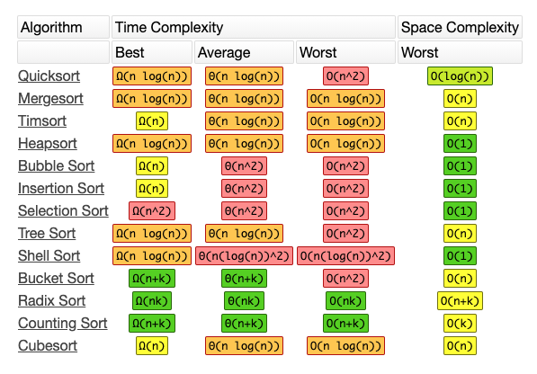

<!-- TOC -->
* [Big O (Сложность алгоритмов)](#big-o-сложность-алгоритмов)
  * [Асимптотический анализ](#асимптотический-анализ)
  * [Порядок роста](#порядок-роста)
  * [Константный — O(1)](#константный--o1)
  * [Линейный — O(n)](#линейный--on)
  * [Логарифмический — O( log n)](#логарифмический--olog-n)
  * [Линеарифметический — O(n·log n)](#линеарифметический--onlog-n)
  * [Квадратичный — O(n ^2)](#квадратичный--on2)
  * [Наилучший, средний и наихудший случаи](#наилучший-средний-и-наихудший-случаи)
  * [Что мы измеряем?](#что-мы-измеряем)
  * [Big O](#big-o)
  * [Операции на структурах данных](#операции-на-структурах-данных)
  * [Сложность алгоритмов сортировки](#сложность-алгоритмов-сортировки)
  * [Полезные ссылки](#полезные-ссылки)
<!-- TOC -->

# Big O (Сложность алгоритмов)

## Асимптотический анализ

Когда мы говорим об измерении сложности алгоритмов, мы подразумеваем анализ времени, которое потребуется для обработки очень большого набора данных. 
Такой анализ называют асимптотическим. Сколько времени потребуется на обработку массива из десяти элементов? Тысячи? Десяти миллионов? Если алгоритм 
обрабатывает тысячу элементов за пять миллисекунд, что случится, если мы передадим в него миллион? Будет ли он выполняться пять минут или пять лет? 
Не стоит ли выяснить это раньше заказчика? Все решают мелочи!

## Порядок роста

Порядок роста описывает то, как сложность алгоритма растет с увеличением размера входных данных. Чаще всего он представлен в виде `O`-нотации (от нем. 
«Ordnung» — порядок) : `O(f(x))`, где `f(x)` — формула, выражающая сложность алгоритма. В формуле может присутствовать переменная `n`, представляющая размер 
входных данных. Ниже приводится список наиболее часто встречающихся порядков роста, но он ни в коем случае не полный.

## Константный — O(1)

Порядок роста `O(1)` означает, что вычислительная сложность алгоритма не зависит от размера входных данных. Следует помнить, однако, что единица в формуле не
значит, что алгоритм выполняется за одну операцию или требует очень мало времени. Он может потребовать и микросекунду, и год. Важно то, что это время не 
зависит от входных данных.

```java
public int GetCount(int[] items) {
    return items.length;
}
```

## Линейный — O(n)

Порядок роста `O(n)` означает, что сложность алгоритма линейно растет с увеличением входного массива. Если линейный алгоритм обрабатывает один элемент пять 
миллисекунд, то мы можем ожидать, что тысячу элементов он обработает за пять секунд.

Такие алгоритмы легко узнать по наличию цикла по каждому элементу входного массива.

```java
public long GetSum(int[] items) {
    long sum = 0;
    foreach (int i in items) {
        sum += i;
    }
    return sum;
}
```

## Логарифмический — O( log n)
Порядок роста `O( log n)` означает, что время выполнения алгоритма растет логарифмически с увеличением размера входного массива. (Прим. пер.: в анализе 
алгоритмов по умолчанию используется логарифм по основанию 2). Большинство алгоритмов, работающих по принципу «деления пополам», имеют логарифмическую 
сложность. Метод `Contains` бинарного дерева поиска (`binary search tree`) также имеет порядок роста `O(log n)`.

## Линеарифметический — O(n·log n)

Линеарифметический (или линейно-логарифмический) алгоритм имеет порядок роста `O(n·log n)`. Некоторые алгоритмы типа «разделяй и властвуй» попадают в эту
категорию. В следующих частях мы увидим два таких примера — сортировка слиянием и быстрая сортировка.

## Квадратичный — O(n ^2)

Время работы алгоритма с порядком роста `O(n ^2)` зависит от квадрата размера входного массива. Несмотря на то, что такой ситуации иногда не избежать, 
квадратичная сложность — повод пересмотреть используемые алгоритмы или структуры данных. Проблема в том, что они плохо масштабируются. 
Например, если массив из тысячи элементов потребует 1 000 000 операций, массив из миллиона элементов потребует 1 000 000 000 000 операций. 
Если одна операция требует миллисекунду для выполнения, квадратичный алгоритм будет обрабатывать миллион элементов 32 года. 
Даже если он будет в сто раз быстрее, работа займет 84 дня.

Мы увидим пример алгоритма с квадратичной сложностью, когда будем изучать пузырьковую сортировку.

## Наилучший, средний и наихудший случаи

Что мы имеем в виду, когда говорим, что порядок роста сложности алгоритма — `O(n)`? Это усредненный случай? Или наихудший? А может быть, наилучший?

Обычно имеется в виду наихудший случай, за исключением тех случаев, когда наихудший и средний сильно отличаются. К примеру, мы увидим примеры алгоритмов, 
которые в среднем имеют порядок роста `O(1)`, но периодически могут становиться `O(n)` (например, `ArrayList.add`). В этом случае мы будем указывать, что 
алгоритм работает в среднем за константное время, и объяснять случаи, когда сложность возрастает.

Самое важное здесь то, что `O(n)` означает, что алгоритм потребует не более `n` шагов.

## Что мы измеряем?

При измерении сложности алгоритмов и структур данных мы обычно говорим о двух вещах: количество операций, требуемых для завершения работы 
(вычислительная сложность), и объем ресурсов, в частности, памяти, который необходим алгоритму (пространственная сложность).

Алгоритм, который выполняется в десять раз быстрее, но использует в десять раз больше места, может вполне подходить для серверной машины с большим объемом
памяти. Но на встроенных системах, где количество памяти ограничено, такой алгоритм использовать нельзя.

В этих статьях мы будем говорить о вычислительной сложности, но при рассмотрении алгоритмов сортировки затронем также вопрос ресурсов.

Операции, количество которых мы будем измерять, включают в себя:

- сравнения («больше», «меньше», «равно»);
- присваивания;
- выделение памяти.
- То, какие операции мы учитываем, обычно ясно из контекста.

К примеру, при описании алгоритма поиска элемента в структуре данных мы почти наверняка имеем в виду операции сравнения. Поиск — это преимущественно процесс 
чтения, так что нет смысла делать присваивания или выделение памяти.

Когда мы говорим о сортировке, мы можем учитывать как сравнения, так и выделения и присваивания. В таких случаях мы будем явно указывать, какие операции мы 
рассматриваем.

## Big O


## Операции на структурах данных


## Сложность алгоритмов сортировки



## Полезные ссылки

[Big O cheatsheet](https://www.bigocheatsheet.com/)

[Оценка сложности алгоритмов, или Что такое О(log n) - tproger](https://tproger.ru/articles/computational-complexity-explained/)

[Алгоритмы и структуры данных для начинающих: сложность алгоритмов - tproger](https://tproger.ru/translations/algorithms-and-data-structures/)

[Data Structures and Algorithms in Java - donbeave](https://github.com/donbeave/interview)
