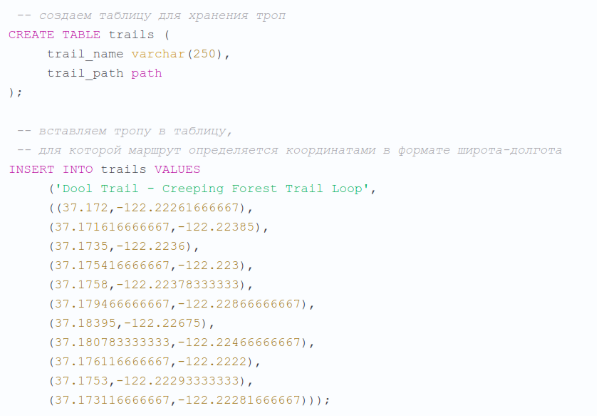

# Compare MySQL and PostgreSQL

## Хранение данных

- `MySQL` - это реляционная база данных, для хранения данных в таблицах используются различные движки, но работа с движками спрятана в самой системе. На синтаксис 
запросов и их выполнение движок не влияет. Поддерживаются такие основные движки `MyISAM`, `InnoDB`, `MEMORY`, `Berkeley DB`. Они отличаются между собой способом 
записи данных на диск, а также методами считывания.
- `Postgresql` представляет из себя объектно реляционную базу данных, которая работает только на одном движке - `storage engine`. Все таблицы представлены в виде 
объектов, они могут наследоваться, а все действия с таблицами выполняются с помощью объективно ориентированных функций. Как и в `MySQL` все данные хранятся на 
диске, в специально отсортированных файлах, но структура этих файлов и записей в них очень сильно отличается.

## Стандарт SQL

Независимо от используемой системы управления базами данных, `SQL` - это стандартизированный язык выполнения запросов. И он поддерживается всеми решениями, даже 
`MySQL` или `Postgresql`. Стандарт `SQL` был разработан в 1986 году и за это время уже вышло нескольких версий.

- `MySQL` поддерживает далеко не все новые возможности стандарта `SQL`. Разработчики выбрали именно этот путь развития, чтобы сохранить `MySQL` простым для 
использования. Компания пытается соответствовать стандартам, но не в ущерб простоте. Если какая-то возможность может улучшить удобство, то разработчики могут 
реализовать ее в виде своего расширения не обращая внимания на стандарт.

- `Postgresql` - это проект с открытым исходным кодом, он разрабатывается командой энтузиастов, и разработчики пытаются максимально соответствовать стандарту `SQL` 
и реализуют все самые новые стандарты. Но все это приводит к ущербу простоты. `Postgresql` очень сложный и из-за этого он не настолько популярен как `MySQL`.

## Возможности обработки

Из предыдущего пункта выплывают и другие отличия `postgresql` от `mysql`, это возможности обработки данных и ограничения. Естественно, соответствие более новым 
стандартам дает более новые возможности.

При выполнении запроса `MySQL` загружает весь ответ сервера в память клиента, при больших объемах данных это может быть не совсем удобно. В основном по функциям 
`Postgresql` превосходит `Mysql`, дальше рассмотрим в каких именно.

`Postgresql` поддерживает использование курсоров для перемещения по полученным данным. Вы получаете только указатель, весь ответ хранится в памяти сервера баз 
данных. Этот указатель можно сохранять между сеансами. Здесь поддерживается построение индексов сразу для нескольких столбцов таблицы. Кроме того, индексы могут 
быть различных типов, кроме `hash` и `b-tree` доступны `GiST` и `SP-GiST` для работы с городами, `GIN` для поиска по тексту, `BRIN` и `Bloom`.

`Postgresql` поддерживает регулярные выражения в запросах, рекурсивные запросы и наследования таблиц. Но тут есть несколько ограничений, например, вы можете 
добавить новое поле только в конец таблицы.

`Postgresql` может обраюатывать очень много данных:

|Параметр                              |Значение                              |
|--------------------------------------|--------------------------------------|
|Максимальный размер базы данных       |Неограничен                           |
|Максимальный размер таблицы           |32TB                                  |
|Максимальный размер строки            |1.6TB                                 |
|Максимальный размер поля              |1GB                                   |
|Максимальное кол-во строк в таблице   |Неограничено                          |
|Максимальное кол-во столбцов в таблице|250-1600 в зависимости от типа столбца|
|Максимальное кол-во индексов в таблице|Неограничено                          |

## Производительность

Базы данных должны обязательно быть оптимизированы для окружения, в котором вы будете работать. Исторически так сложилось что `MySQL` ориентировалась на 
максимальную производительность, а `Postgresql` разрабатывалась как база данных с большим количеством настроек и максимально соответствующую стандарту. Но со 
временем `Postgresql` получил много улучшений и оптимизаций.

В большинстве случаев для организации работы с базой данных в `MySQL` используется таблица `InnoDB`, эта таблица представляет из себя `B-дерево` с индексами. 
Индексы позволяют очень быстро получить данные из диска, и для этого будет нужно меньше дисковых операций. Но сканирование дерева требует нахождения двух индексов, 
а это уже медленно. Все это значит что `MySQL` будет быстрее `Postgresql` только при использовании первичного ключа.

Вся заголовочная информация таблиц `Postgresql` находится в оперативной памяти. Вы не можете создать таблицу, которая будет не в памяти. Записи таблицы сортируются 
по индексу, а поэтому вы можете их очень быстро извлечь. Для большего удобства вы можете применять несколько индексов к одной таблице. В целом `PostgreSQL` работает 
быстрее, за исключениям использования первичных ключей. Давайте рассмотрим несколько тестов с различными операциями.

## Дополнительно

- В `mysql` типы данных более соответствуют синтаксису `sql`.
- В `pg` можно хранить массивы и `json`, есть тип `money`.

## Геометрические данные

Геоданные быстро становятся основным требованием для многих приложений. `PostgreSQL` уже давно поддерживает множество геометрических типов данных, таких как точки, 
линии, круги и многоугольники. Один из этих типов – `PATH`, он состоит из множества последовательно расположенных точек и может быть открытым (начальная и конечная 
точки не связаны) или закрытым (начальная и конечная точки связаны). Давайте рассмотрим в качестве примера туристическую тропу. В данном случае туристическая тропа 
— это петля, поэтому начальная и конечная точки связаны, и, значит, мой путь является закрытым. Круглые скобки вокруг набора координат указывают на закрытый путь, а 
квадратные — на открытый.

## Создание нового типа

Если вдруг так случится, что обширного списка типов данных `pg` вам окажется недостаточно, вы можете использовать команду `CREATE TYPE`, чтобы создать новые типы 
данных, такие как составной, перечисляемый, диапазон и базовый.
