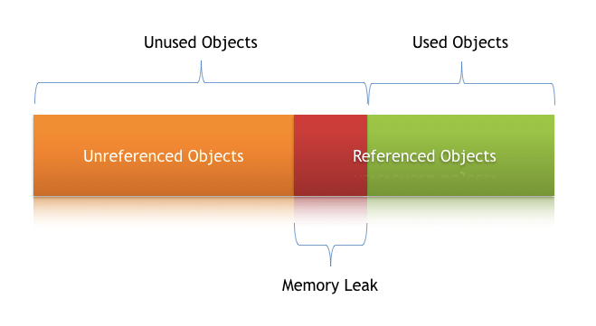
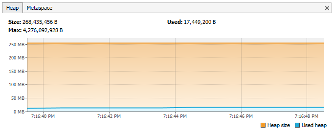
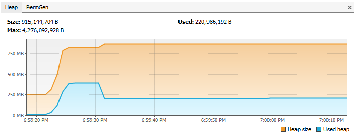

# Memory Leaks (Утечка памяти)

Одно из основных преимуществ Java - автоматическое управление памятью с помощью встроенного сборщика мусора (или сокращенно GC). 
`Garbage collector` неявно заботится о распределении и освобождении памяти и, таким образом, способен обрабатывать большинство проблем с утечкой памяти.

Хотя сборщик мусора эффективно обрабатывает значительную часть памяти, он не гарантирует надежного решения проблемы утечки памяти. `GC` довольно умный, 
но не безупречный. Утечки памяти все же могут подкрасться даже в приложениях добросовестного разработчика.

По-прежнему могут возникать ситуации, когда приложение генерирует значительное количество лишних объектов, истощая тем самым важные ресурсы памяти, 
что иногда приводит к сбою всего приложения.

`Утечки памяти` - настоящая проблема Java. В этом руководстве мы увидим возможные причины утечек памяти, как распознать их во время выполнения и как бороться 
с ними в нашем приложении.

## Что такое утечка памяти

Утечка памяти - это ситуация, когда в куче присутствуют объекты, которые больше не используются, но сборщик мусора не может удалить их из памяти и, 
таким образом, они обслуживаются без необходимости.

Утечка памяти - это плохо, потому что она блокирует ресурсы памяти и со временем снижает производительность системы. И если с этим не справиться, 
приложение в конечном итоге исчерпает свои ресурсы и завершится с фатальной ошибкой `java.lang.OutOfMemoryError`.

Есть два разных типа объектов, которые хранятся в памяти кучи - объекты, на которые есть активные ссылки и объекты, на которые таких ссылок нет. 
Ссылочные объекты - это те, у которых все еще есть активные ссылки в приложении, тогда как объекты, на которые нет ссылок, не имеют активных ссылок.

Сборщик мусора периодически удаляет объекты, на которые нет ссылок, но никогда не собирает объекты, на которые все еще ссылаются. Вот где могут возникнуть 
утечки памяти:



## Симптомы утечки памяти

- Сильное снижение производительности при непрерывной работе приложения в течение длительного времени.
- Ошибка кучи `OutOfMemoryError` в приложении.
- Самопроизвольные и странные вылеты приложений.

Давайте подробнее рассмотрим некоторые из этих сценариев и способы их устранения.

## Утечка памяти через статические поля

Первый сценарий, который может вызвать потенциальную утечку памяти, - это интенсивное использование статических переменных.

В Java статические поля имеют жизнь, которая обычно соответствует всему времени жизни работающего приложения (если `ClassLoader` не получает право на сборку
мусора).

Давайте создадим простую программу на Java, которая заполняет статический список:

```java
public class StaticTest {
    public static List<Double> list = new ArrayList<>();
 
    public void populateList() {
        for (int i = 0; i < 10000000; i++) {
            list.add(Math.random());
        }
        Log.info("Debug Point 2");
    }
 
    public static void main(String[] args) {
        Log.info("Debug Point 1");
        new StaticTest().populateList();
        Log.info("Debug Point 3");
    }
}
```

Теперь, если мы проанализируем память кучи во время выполнения этой программы, то увидим, что между точками отладки 1 и 2, как и ожидалось, память кучи 
увеличилась.

Но когда мы выходим из метода `populateList()` в точке отладки 3, память кучи еще не собирает мусор, как мы можем видеть в этом ответе VisualVM:


Однако в приведенной выше программе, в строке номер 2, если мы просто отбросим ключевое слово `static`, это приведет к резкому изменению использования памяти,
этот ответ Visual VM показывает:


Первая часть до точки отладки практически такая же, как и в случае статики. Но на этот раз после того, как мы выйдем из метода `populateList()`, **вся память 
списка будет собрана мусором, потому что у нас нет на него ссылки**.

Следовательно, нам нужно уделять очень пристальное внимание использованию статических переменных. Если коллекции или большие объекты объявлены как статические,
то они остаются в памяти на протяжении всего жизненного цикла приложения, тем самым блокируя жизненно важную память, которая в противном случае могла бы
использоваться в другом месте.

**Как это предотвратить?**

- Сведите к минимуму использование статических переменных
- При использовании синглтонов полагайтесь на реализацию, которая лениво загружает объект (`lazy load`) вместо загрузки с нетерпением (`eager load`)

## Через незакрытые ресурсы

Каждый раз, когда мы устанавливаем новое соединение или открываем поток, JVM выделяет память для этих ресурсов. Несколько примеров включают подключения к базе
данных, input streams и session objects.

Если вы забудете закрыть эти ресурсы, это может заблокировать память, что сделает их недоступными для сборки мусора. Это может произойти даже в случае 
исключения, которое не позволяет выполнению программы достичь оператора, обрабатывающего код для закрытия этих ресурсов.

В любом случае открытое соединение, оставшееся от ресурсов, потребляет память, и если мы не справимся с ними, они могут ухудшить производительность и даже
привести к `OutOfMemoryError`.

**Как это предотвратить?**

- Всегда используйте блок `finally`, чтобы закрыть ресурсы
- Код (даже в блоке `finally`), закрывающий ресурсы, сам по себе не должен иметь исключений.
- При использовании Java 7+ мы можем использовать блок `try-with-resources`

## Неправильная реализация equals() и hashCode()

При определении новых классов очень распространенной ошибкой является неправильное переопределение методов `equals()` и `hashCode()`.

`HashSet` и `HashMap` используют эти методы во многих операциях, и если они неправильно переопределены, они могут стать источником потенциальных проблем с
утечкой памяти.

Возьмем пример тривиального класса `Person` и используем его в качестве ключа в `HashMap`:

```java
public class Person {
    public String name;
    
    public Person(String name) {
        this.name = name;
    }
}
```

Теперь мы вставим повторяющиеся объекты `Person` в map, использующую этот ключ. Помните, что map не может содержать повторяющиеся ключи:

```java
	@Test
public void givenMap_whenEqualsAndHashCodeNotOverridden_thenMemoryLeak() {
    Map<Person, Integer> map = new HashMap<>();
    for(int i=0; i<100; i++) {
        map.put(new Person("john"), 1);
    }
    Assert.assertFalse(map.size() == 1);
}
```

Здесь мы используем `Person` в качестве ключа. Поскольку `Map` не допускает дублирования ключей, многочисленные дублирующиеся объекты `Person`, которые мы 
вставили в качестве ключа, не должны увеличивать память.

Но так как мы не определили правильный метод `equals()`, дублирующиеся объекты накапливаются и увеличивают память, поэтому мы видим более одного объекта в
памяти. Память кучи в VisualVM для этого выглядит так:


Однако, если бы мы правильно переопределили методы `equals()` и `hashCode()`, тогда на этой карте существовал бы только один объект `Person`.

Давайте посмотрим на правильные реализации `equals()` и `hashCode()` для нашего класса `Person`:

```java
public class Person {
    public String name;
    
    public Person(String name) {
        this.name = name;
    }
    
    @Override
    public boolean equals(Object o) {
        if (o == this) return true;
        if (!(o instanceof Person)) {
            return false;
        }
        Person person = (Person) o;
        return person.name.equals(name);
    }
    
    @Override
    public int hashCode() {
        int result = 17;
        result = 31 * result + name.hashCode();
        return result;
    }
}
```

И в этом случае верны следующие утверждения:

```java
@Test
public void givenMap_whenEqualsAndHashCodeNotOverridden_thenMemoryLeak() {
    Map<Person, Integer> map = new HashMap<>();
    for(int i=0; i<2; i++) {
        map.put(new Person("john"), 1);
    }
    Assert.assertTrue(map.size() == 1);
}
```

После правильного переопределения `equals()` и `hashCode()` память кучи для той же программы выглядит так:


Другой пример - использование инструмента `ORM`, такого как `Hibernate`, который использует методы `equals()` и `hashCode()` для анализа объектов и сохранения
их в кеше.

Вероятность утечки памяти довольно высока, если эти методы не переопределены, потому что `Hibernate` не сможет сравнивать объекты и заполнит свой кеш
повторяющимися объектами.

**Как это предотвратить?**

- Как правило, при определении новых сущностей всегда переопределяйте методы `equals()` и `hashCode()`.
- Недостаточно просто переопределить, нужно переопределить правильно.

## Внутренние классы, которые ссылаются на внешние классы

Это происходит в случае нестатических внутренних классов (анонимных классов). Для инициализации этим внутренним классам всегда требуется экземпляр внешнего
класса.

Каждый нестатический внутренний класс по умолчанию имеет неявную ссылку на его содержащий класс. Если мы используем объект этого внутреннего класса в нашем 
приложении, то **даже после того, как объект нашего содержащего класса выйдет за пределы области видимости, он не будет собираться мусором**.

Рассмотрим класс, который содержит ссылку на множество громоздких объектов и имеет нестатический внутренний класс. 
Теперь, когда мы создаем объект только внутреннего класса, модель памяти выглядит так:


Однако, если мы просто объявим внутренний класс статическим, то та же модель памяти будет выглядеть так:



Это происходит потому, что объект внутреннего класса неявно содержит ссылку на объект внешнего класса, что делает его недопустимым кандидатом на сборку мусора.
То же самое и с анонимными классами.

**Как это предотвратить?**

- Если внутреннему классу не нужен доступ к содержащим его членам класса, подумайте о том, чтобы превратить его в статический класс.

## Через метод finalize()

Использование финализаторов - еще один источник потенциальных проблем с утечкой памяти. Всякий раз, когда метод `finalize()` класса переопределяется, объекты
этого класса не удаляются `GC` мгновенно. Вместо этого сборщик мусора ставит их в очередь на завершение, которое происходит позже.

Кроме того, если код, написанный в методе `finalize()`, не является оптимальным и если очередь финализатора не успевает за сборщиком мусора Java, то рано или
поздно нашему приложению суждено встретить `OutOfMemoryError`.

Чтобы продемонстрировать это, давайте предположим, что у нас есть класс, для которого мы переопределили метод `finalize()`, и что для его выполнения требуется
немного времени. Когда большое количество объектов этого класса получает сборщик мусора, то в `VisualVM` это выглядит так:



Однако, если мы просто удалим переопределенный метод `finalize()`, то та же программа даст следующий ответ:


**Как это предотвратить?**

- Мы всегда должны избегать финализаторов

## Интернированные строки

`String pool` в Java претерпел серьезные изменения в Java 7, когда он был переведен из `PermGen` в `HeapSpace`. Но для приложений, работающих с версией 6 и
ниже, мы должны быть более внимательными при работе с большими строками.

Если мы прочитаем огромный массивный объект `String` и вызовем `intern()` для этого объекта, он перейдет в пул строк, который находится в `PermGen` 
(постоянная память), и останется там, пока выполняется наше приложение. Это блокирует память и создает серьезную утечку памяти в нашем приложении.

`PermGen` для этого случая в JVM 1.6 выглядит так в `VisualVM`:


В отличие от этого, в методе, если мы просто читаем строку из файла и не интернируем ее, тогда `PermGen` выглядит так:


**Как это предотвратить?**

- Самый простой способ решить эту проблему - обновить до последней версии Java, поскольку пул строк перемещается в `HeapSpace` с версии Java 7 и далее.
- При работе с большими строками увеличьте размер пространства `PermGen`, чтобы избежать возможных ошибок `OutOfMemoryErrors`:
```java
-XX: MaxPermSize=512м
```

## Использование ThreadLocals

`ThreadLocal` - это конструкция, которая дает нам возможность изолировать состояние для конкретного потока и, таким образом, позволяет нам достичь безопасности
потоков.

При использовании этой конструкции каждый поток будет содержать неявную ссылку на свою копию переменной `ThreadLocal` и будет поддерживать свою собственную
копию вместо совместного использования ресурса несколькими потоками, пока поток жив.

Несмотря на свои преимущества, использование переменных `ThreadLocal` вызывает споры, так как они печально известны тем, что вызывают утечки памяти при 
неправильном использовании. Джошуа Блох однажды 
[прокомментировал](http://jsr166-concurrency.10961.n7.nabble.com/Threadlocals-and-memory-leaks-in-J2EE-td3960.html#a3984) локальное использование потока:

> Небрежное использование пулов потоков в сочетании с неаккуратным использованием локальных переменных потоков может вызвать непреднамеренное удержание 
объекта, как было отмечено во многих местах. Но возлагать вину на thread local переменные неоправданно.

Предполагается, что `ThreadLocal` будут собирать мусор, когда удерживающий поток больше не работает. Но проблема возникает, когда `ThreadLocal` используются
вместе с современными серверами приложений.

Современные серверы приложений используют `thread pool` для обработки запросов вместо создания новых (например, `Executor`). Более того, они также используют
отдельный classloader.

Поскольку пулы потоков на серверах приложений работают по концепции повторного использования потоков, они никогда не собираются сборщиком мусора - вместо этого
они повторно используются для обслуживания другого запроса.

Теперь, если какой-либо класс создает переменную `ThreadLocal`, но не удаляет ее явно, то копия этого объекта останется в рабочем потоке даже после остановки
веб-приложения, что предотвращает сборку мусора.

**Как это предотвратить?**

- Рекомендуется очищать `ThreadLocal`, когда они больше не используются - `ThreadLocal` предоставляет метод `remove()`, который удаляет значение текущего 
потока для этой переменной.
- Не используйте `ThreadLocal.set(null)` для очистки значения - он фактически не очищает значение, а вместо этого будет искать карту, связанную с текущим 
потоком, и устанавливать пару ключ-значение как текущий поток и `null` соответственно
- Еще лучше рассматривать `ThreadLocal` как ресурс, который необходимо закрыть в блоке `finally`, чтобы убедиться, что он всегда закрыт, даже в случае
исключения:

```java
try {
    threadLocal.set(System.nanoTime());
    //... further processing
}
finally {
    threadLocal.remove();
}
```

## Другие стратегии борьбы с утечками памяти

Хотя не существует универсального решения при работе с утечками памяти, есть несколько способов минимизировать эти утечки.

#### Включить профилирование

Профилировщики Java - это инструменты, которые отслеживают и диагностируют утечки памяти через приложение. Они анализируют, что происходит внутри нашего
приложения, например, как распределяется память.

Используя профилировщики, мы можем сравнивать различные подходы и находить области, в которых мы можем оптимально использовать наши ресурсы.

Мы использовали `Java VisualVM` в наших примерах. Но есть и другие типы профилировщиков, такие как `Mission Control`, `JProfiler`, `YourKit`, `Java VisualVM` и 
`Netbeans Profiler`.

#### Подробная сборка мусора

Включив подробную сборку мусора, мы отслеживаем подробную трассировку `GC`. Чтобы включить это, нам нужно добавить следующее в нашу конфигурацию JVM:

```java
-verbose: gc
```

Добавляя этот параметр, мы можем видеть детали того, что происходит внутри GC:


#### Используйте Reference Objects, чтобы избежать утечек памяти

Мы также можем прибегнуть к ссылочным объектам в Java, которые встроены в пакет `java.lang.ref`, чтобы справиться с утечками памяти. 
Используя пакет `java.lang.ref`, вместо прямых ссылок на объекты мы используем специальные ссылки на объекты, которые позволяют легко собирать мусор.

`ReferenceQueue` предназначены для информирования нас о действиях, выполняемых сборщиком мусора.

#### Benchmarking

Мы можем измерить и проанализировать производительность кода Java, выполнив тесты производительности. Таким образом, мы можем сравнить эффективность 
альтернативных подходов к решению одной и той же задачи. Это может помочь нам выбрать лучший подход и может помочь нам сохранить память.

## Полезные ссылки

[Утечки памяти в Java - Baeldung](https://www.baeldung.com/java-memory-leaks)
