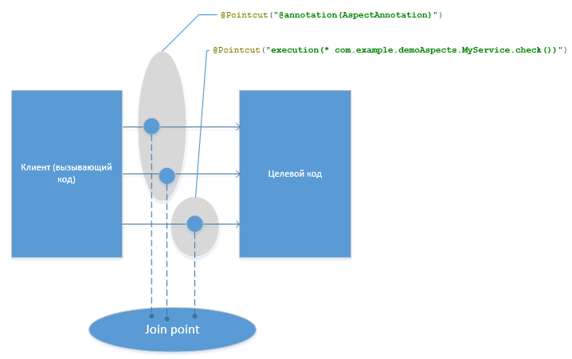
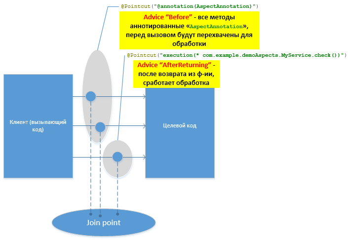

# AOP

Аспектно-ориентированное программирование (`АОП`) — это парадигма программирования являющейся дальнейшим развитием процедурного и объектно-ориентированного 
программирования (`ООП`). Идея `АОП` заключается в выделении так называемой сквозной функциональности. И так все по порядку, здесь я покажу как это сделать в 
`Java` — `Spring @AspectJ annotation` стиле (есть еще `schema-based xml` стиль, функциональность аналогичная).

## Выделении сквозной функциональности

До


После


Т.е. есть функциональность которая затрагивает несколько модулей, но она не имеет прямого отношения к бизнес коду, и ее хорошо бы вынести в отдельное место, 
это и показано на рисунке выше.

## Join point


`Join point` — следующее понятие `АОП`, это точки наблюдения, присоединения к коду, где планируется введение функциональности.

## Pointcut



`Pointcut` — это срез, запрос точек присоединения, — это может быть одна и более точек. Правила запросов точек очень разнообразные, на рисунке выше, запрос по 
аннотации на методе и конкретный метод. Правила можно объединять по `&&`, `||`, `!`.

## Advice



`Advice` — набор инструкций выполняемых на точках среза (`Pointcut`). Инструкции можно выполнять по событию разных типов:
- `Before` — перед вызовом метода
- `After` — после вызова метода
- `After returning` — после возврата значения из функции
- `After throwing` — в случае exception
- `After finally` — в случае выполнения блока `finally`
- `Around` — можно сделать пред., пост., обработку перед вызовом метода, а также вообще обойти вызов метода

на один `Pointcut` можно «повесить» несколько `Advice` разного типа.

## Aspect


`Aspect` — модуль в котором собраны описания `Pointcut` и `Advice`.

Сейчас приведу пример и окончательно все встанет (или почти все) на свои места. Все знаем про логирование кода который пронизывает многие модули, не имея 
отношения к бизнес коду, но тем не менее без него нельзя. И так отделяю этот функционал от бизнес кода.

## Пример

Целевой сервис

```java
@Service
public class MyService {

    public void method1(List<String> list) {
        list.add("method1");
        System.out.println("MyService method1 list.size=" + list.size());
    }

    @AspectAnnotation
    public void method2() {
        System.out.println("MyService method2");
    }

    public boolean check() {
        System.out.println("MyService check");
        return true;
    }
}
```

Аспект с описанием `Pointcut` и `Advice`.

```java
@Aspect
@Component
public class MyAspect {

    private Logger logger = LoggerFactory.getLogger(this.getClass());

    @Pointcut("execution(public * com.example.demoAspects.MyService.*(..))")
    public void callAtMyServicePublic() { }

    @Before("callAtMyServicePublic()")
    public void beforeCallAtMethod1(JoinPoint jp) {
        String args = Arrays.stream(jp.getArgs())
                .map(a -> a.toString())
                .collect(Collectors.joining(","));
        logger.info("before " + jp.toString() + ", args=[" + args + "]");
    }

    @After("callAtMyServicePublic()")
    public void afterCallAt(JoinPoint jp) {
        logger.info("after " + jp.toString());
    }
}
```

И вызывающий тестовый код

```java
@RunWith(SpringRunner.class)
@SpringBootTest
public class DemoAspectsApplicationTests {

    @Autowired
    private MyService service;

    @Test
    public void testLoggable() {
        List<String> list = new ArrayList();
        list.add("test");

        service.method1(list);
        service.method2();
        Assert.assertTrue(service.check());
    }

}
```

В целевом сервисе нет никакого упоминания про запись в лог, в вызывающем коде тем более, в все логирование сосредоточено в отдельном модуле в `Pointcut` 
`callAtMyServicePublic` класса `MyAspect`.

Я запросил все `public` методы `MyService` с любым типом возврата `*` и количеством аргументов `(..)`

В `Advice Before` и `After` которые ссылаются на `Pointcut` (`callAtMyServicePublic`), я написал инструкции для записи в лог. `JoinPoint` это не обязательный 
параметр, который предоставляет дополнительную информацию, но если он используется, то он должен быть первым.

Все разнесено в разные модули! Вызывающий код, целевой, логирование.

Результат выполнения:


## Правила Pointcut могут быть различные

- Запрос по аннотации на методе
```java
@Pointcut("@annotation(AspectAnnotation)")
public void callAtMyServiceAnnotation() { }

@Before("callAtMyServiceAnnotation()")
public void beforeCallAt() { }
```

- Запрос на конкретный метод с указанием параметров целевого метода
```java
@Pointcut("execution(* com.example.demoAspects.MyService.method1(..)) && args(list,..))")
public void callAtMyServiceMethod1(List<String> list) { }

@Before("callAtMyServiceMethod1(list)")
public void beforeCallAtMethod1(List<String> list) { }
```

- `Pointcut` для результата возврата
```java
@Pointcut("execution(* com.example.demoAspects.MyService.check())")
public void callAtMyServiceAfterReturning() { }

@AfterReturning(pointcut="callAtMyServiceAfterReturning()", returning="retVal")
public void afterReturningCallAt(boolean retVal) { }
```

- Пример профилирование того же сервиса с использованием `Advice` типа `Around`
```java
@Aspect
@Component
public class MyAspect {

    @Pointcut("execution(public * com.example.demoAspects.MyService.*(..))")
    public void callAtMyServicePublic() {
    }

    @Around("callAtMyServicePublic()")
    public Object aroundCallAt(ProceedingJoinPoint call) throws Throwable {
        StopWatch clock = new StopWatch(call.toString());
        try {
            clock.start(call.toShortString());
            return call.proceed();
        } finally {
            clock.stop();
            System.out.println(clock.prettyPrint());
        }
    }
}
```

## Полезные ссылки

[Spring AOP - habr](https://habr.com/ru/post/428548/)
Если запустить вызывающий код с вызовами методов `MyService`, то получим время вызова каждого метода. 
